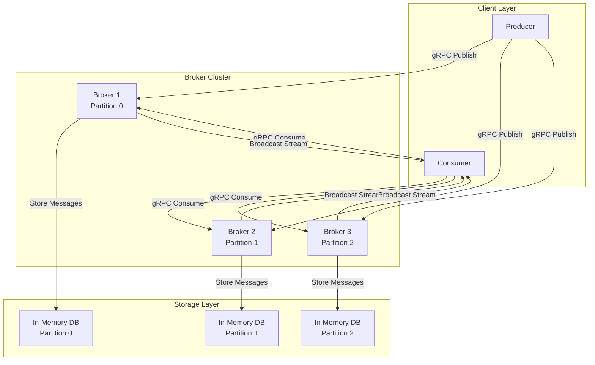
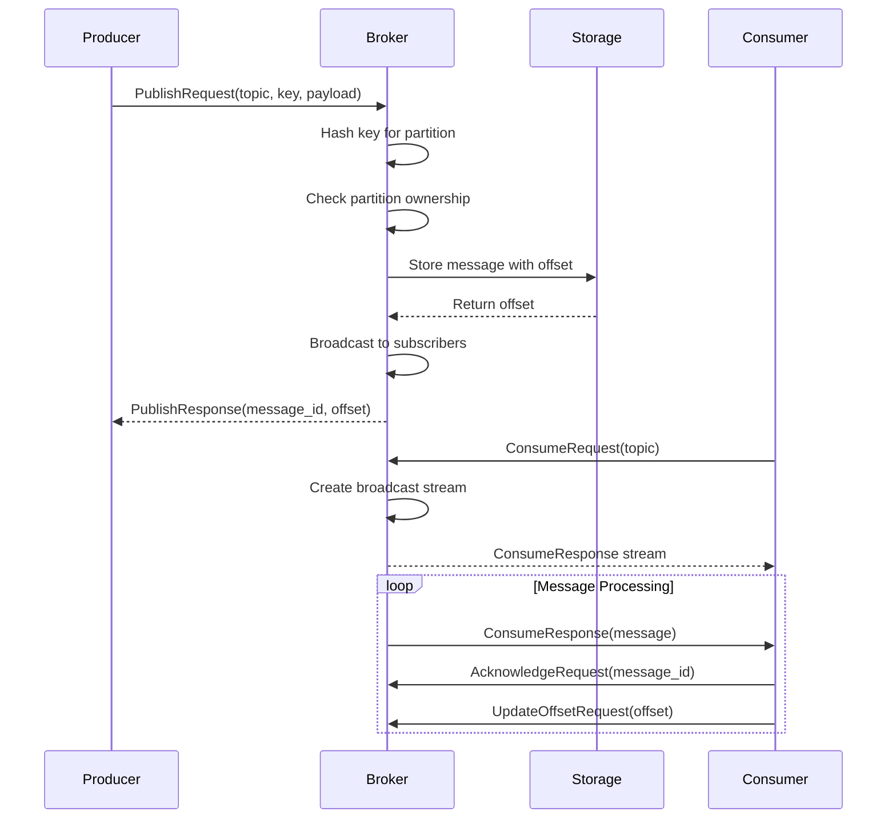
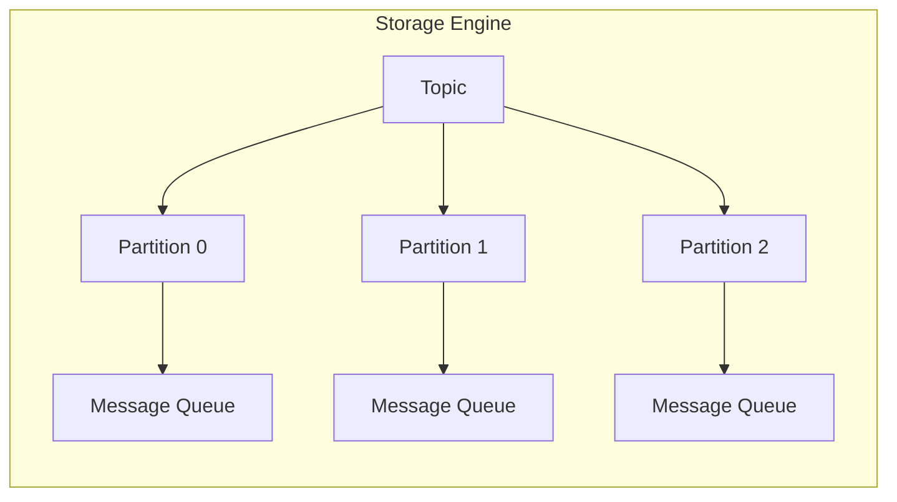

# Rafka

**A High-Performance Distributed Message Broker Built in Rust**

Rafka is a blazing-fast, experimental distributed asynchronous message broker inspired by Apache Kafka. Built with Rust and leveraging Tokio's async runtime, it delivers exceptional performance through its peer-to-peer mesh architecture and custom in-memory database for unparalleled scalability and low-latency message processing.

## 🚀 Key Features

- **High-Performance Async Architecture**: Built on Tokio for maximum concurrency and throughput
- **gRPC Communication**: Modern protocol buffers for efficient inter-service communication
- **Partitioned Message Processing**: Hash-based partitioning for horizontal scalability
- **In-Memory Storage Engine**: Custom-built storage with retention policies and metrics
- **Offset Tracking**: Consumer offset management for reliable message delivery
- **Retention Policies**: Configurable message retention based on age and size
- **Real-time Metrics**: Built-in monitoring and performance metrics
- **Modular Design**: Clean separation of concerns across multiple crates

## 🏗️ Architecture Overview

### System Architecture Diagram



### Message Flow Sequence Diagram



## 📁 Project Structure

```
rafka/
├── Cargo.toml                 # Workspace manifest
├── config/
│   └── config.yml            # Configuration file
├── scripts/                  # Demo and utility scripts
│   ├── helloworld.sh         # Basic producer-consumer demo
│   ├── partitioned_demo.sh   # Multi-broker partitioning demo
│   ├── retention_demo.sh     # Message retention demo
│   ├── offset_tracking_demo.sh # Consumer offset tracking demo
│   └── kill.sh               # Process cleanup script
├── src/
│   └── bin/                  # Executable binaries
│       ├── start_broker.rs   # Broker server
│       ├── start_producer.rs # Producer client
│       ├── start_consumer.rs # Consumer client
│       └── check_metrics.rs  # Metrics monitoring
├── crates/                   # Core library crates
│   ├── core/                 # Core types and gRPC definitions
│   │   ├── src/
│   │   │   ├── lib.rs
│   │   │   ├── message.rs    # Message structures
│   │   │   └── proto/
│   │   │       └── rafka.proto # gRPC service definitions
│   │   └── build.rs          # Protocol buffer compilation
│   ├── broker/               # Broker implementation
│   │   └── src/
│   │       ├── lib.rs
│   │       └── broker.rs     # Core broker logic
│   ├── producer/             # Producer implementation
│   │   └── src/
│   │       ├── lib.rs
│   │       └── producer.rs   # Producer client
│   ├── consumer/             # Consumer implementation
│   │   └── src/
│   │       ├── lib.rs
│   │       └── consumer.rs   # Consumer client
│   └── storage/              # Storage engine
│       └── src/
│           ├── lib.rs
│           └── db.rs         # In-memory database
├── docs/
│   └── getting_started.md    # Getting started guide
├── tasks/
│   └── Roadmap.md           # Development roadmap
├── Dockerfile               # Container configuration
└── LICENSE                  # MIT License
```

## 🚀 Quick Start

### Prerequisites

- **Rust**: Latest stable version (1.70+)
- **Cargo**: Comes with Rust installation
- **Protocol Buffers**: For gRPC compilation

### Installation

1. **Clone the repository**:
```bash
git clone https://github.com/yourusername/rafka.git
cd rafka
```

2. **Build the project**:
```bash
cargo build --release
```

3. **Run the basic demo**:
```bash
./scripts/helloworld.sh
```

### Manual Setup

1. **Start a broker**:
```bash
cargo run --bin start_broker -- --port 50051 --partition 0 --total-partitions 3
```

2. **Start a consumer**:
```bash
cargo run --bin start_consumer -- --port 50051
```

3. **Send messages**:
```bash
cargo run --bin start_producer -- --message "Hello, Rafka!" --key "test-key"
```

## 🔧 Configuration

### Broker Configuration

The broker can be configured via command-line arguments:

```bash
cargo run --bin start_broker -- \
  --port 50051 \
  --partition 0 \
  --total-partitions 3 \
  --retention-seconds 604800
```

**Available Options**:
- `--port`: Broker listening port (default: 50051)
- `--partition`: Partition ID for this broker (default: 0)
- `--total-partitions`: Total number of partitions (default: 1)
- `--retention-seconds`: Message retention time in seconds (default: 7 days)

### Configuration File

Edit `config/config.yml` for persistent settings:

```yaml
server:
  host: "127.0.0.1"
  port: 9092

log:
  level: "info"  # debug, info, warn, error

broker:
  replication_factor: 3
  default_topic_partitions: 1

storage:
  type: "in_memory"
```

## 🏛️ Core Components

### 1. Core (`rafka-core`)

**Purpose**: Defines fundamental types and gRPC service contracts.

**Key Components**:
- **Message Structures**: `Message`, `MessageAck`, `BenchmarkMetrics`
- **gRPC Definitions**: Protocol buffer definitions for all services
- **Serialization**: Serde-based serialization for message handling

**Key Files**:
- `message.rs`: Core message types and acknowledgment structures
- `proto/rafka.proto`: gRPC service definitions

### 2. Broker (`rafka-broker`)

**Purpose**: Central message routing and coordination service.

**Key Features**:
- **Partition Management**: Hash-based message partitioning
- **Topic Management**: Dynamic topic creation and subscription
- **Broadcast Channels**: Efficient message distribution to consumers
- **Offset Tracking**: Consumer offset management
- **Retention Policies**: Configurable message retention
- **Metrics Collection**: Real-time performance metrics

**Key Operations**:
- `publish()`: Accept messages from producers
- `consume()`: Stream messages to consumers
- `subscribe()`: Register consumer subscriptions
- `acknowledge()`: Process message acknowledgments
- `update_offset()`: Track consumer progress

### 3. Producer (`rafka-producer`)

**Purpose**: Client library for publishing messages to brokers.

**Key Features**:
- **Connection Management**: Automatic broker connection handling
- **Message Publishing**: Reliable message delivery with acknowledgments
- **Error Handling**: Comprehensive error reporting
- **UUID Generation**: Unique message identification

**Usage Example**:
```rust
let mut producer = Producer::new("127.0.0.1:50051").await?;
producer.publish("my-topic".to_string(), "Hello World".to_string(), "key-1".to_string()).await?;
```

### 4. Consumer (`rafka-consumer`)

**Purpose**: Client library for consuming messages from brokers.

**Key Features**:
- **Subscription Management**: Topic subscription handling
- **Stream Processing**: Asynchronous message streaming
- **Automatic Acknowledgment**: Built-in message acknowledgment
- **Offset Tracking**: Automatic offset updates
- **Channel-based API**: Clean async/await interface

**Usage Example**:
```rust
let mut consumer = Consumer::new("127.0.0.1:50051").await?;
consumer.subscribe("my-topic".to_string()).await?;
let mut rx = consumer.consume("my-topic".to_string()).await?;
while let Some(message) = rx.recv().await {
    println!("Received: {}", message);
}
```

### 5. Storage (`rafka-storage`)

**Purpose**: High-performance in-memory storage engine.

**Key Features**:
- **Partition-based Storage**: Separate queues per partition
- **Retention Policies**: Age and size-based message retention
- **Offset Management**: Efficient offset tracking and retrieval
- **Acknowledgment Tracking**: Consumer acknowledgment management
- **Metrics Collection**: Storage performance metrics
- **Memory Optimization**: Efficient memory usage with cleanup

**Storage Architecture**:


## 🔄 Message Flow

### Publishing Flow

1. **Producer** sends `PublishRequest` to **Broker**
2. **Broker** hashes the message key to determine partition
3. **Broker** checks partition ownership
4. **Broker** stores message in **Storage** with unique offset
5. **Broker** broadcasts message to subscribed consumers
6. **Broker** returns `PublishResponse` with message ID and offset

### Consumption Flow

1. **Consumer** sends `ConsumeRequest` to **Broker**
2. **Broker** creates broadcast stream for the topic
3. **Broker** streams messages via gRPC to **Consumer**
4. **Consumer** processes message and sends acknowledgment
5. **Consumer** updates offset to track progress
6. **Storage** cleans up acknowledged messages based on retention policy

## 📊 Performance Features

### Partitioning Strategy

Rafka uses hash-based partitioning for efficient message distribution:

```rust
fn hash_key(&self, key: &str) -> u32 {
    key.bytes().fold(0u32, |acc, b| acc.wrapping_add(b as u32))
}

fn owns_partition(&self, message_key: &str) -> bool {
    let hash = self.hash_key(message_key);
    hash % self.total_partitions == self.partition_id
}
```

### Retention Policies

Configurable message retention based on:
- **Time-based**: Maximum age (default: 7 days)
- **Size-based**: Maximum storage size (default: 1GB)

### Metrics Collection

Built-in metrics for monitoring:
- Total messages stored
- Total bytes consumed
- Oldest message age
- Consumer offset positions

## 🧪 Demo Scripts

### 1. Hello World Demo
```bash
./scripts/helloworld.sh
```
Basic producer-consumer interaction demonstration.

### 2. Partitioned Demo
```bash
./scripts/partitioned_demo.sh
```
Multi-broker setup with hash-based partitioning.

### 3. Retention Demo
```bash
./scripts/retention_demo.sh
```
Demonstrates message retention policies.

### 4. Offset Tracking Demo
```bash
./scripts/offset_tracking_demo.sh
```
Shows consumer offset management and recovery.

## 🛠️ Development

### Building from Source

```bash
# Clone repository
git clone https://github.com/yourusername/rafka.git
cd rafka

# Build all crates
cargo build

# Run tests
cargo test

# Build release version
cargo build --release
```

### Running Tests

```bash
# Run all tests
cargo test

# Run specific crate tests
cargo test -p rafka-storage
cargo test -p rafka-broker
```

### Code Structure

The project follows Rust best practices with:
- **Workspace Organization**: Multiple crates in a single workspace
- **Separation of Concerns**: Each component in its own crate
- **Async/Await**: Modern async Rust with Tokio
- **Error Handling**: Comprehensive error types and handling
- **Testing**: Unit tests for all major components

## 🚧 Current Status

**⚠️ Early Development - Not Production Ready**

Rafka is currently in active development. The current implementation provides:

✅ **Completed Features**:
- Basic message publishing and consumption
- Hash-based partitioning
- In-memory storage with retention policies
- Consumer offset tracking
- gRPC-based communication
- Metrics collection
- Demo scripts and examples

🔄 **In Progress**:
- Peer-to-peer mesh networking
- Distributed consensus algorithms
- Kubernetes deployment configurations
- Performance optimizations

📋 **Planned Features**:
- Replication across multiple brokers
- Fault tolerance and recovery
- Security and authentication
- Client SDKs for multiple languages
- Comprehensive monitoring and alerting

## 🤝 Contributing

We welcome contributions! Here are some areas where you can help:

### High Priority
- **P2P Mesh Implementation**: Distributed node discovery and communication
- **Consensus Algorithms**: Leader election and cluster coordination
- **Replication**: Cross-broker message replication
- **Fault Tolerance**: Node failure detection and recovery

### Medium Priority
- **Performance Optimization**: Message batching and compression
- **Security**: TLS encryption and authentication
- **Monitoring**: Prometheus metrics and Grafana dashboards
- **Documentation**: API documentation and tutorials

### Getting Started
1. Fork the repository
2. Create a feature branch
3. Make your changes
4. Add tests for new functionality
5. Submit a pull request

## 📄 License

This project is licensed under the MIT License - see the [LICENSE](./LICENSE) file for details.

## 🙏 Acknowledgments

- [Apache Kafka](https://kafka.apache.org) for inspiration on messaging systems
- [Tokio](https://tokio.rs) for the excellent async runtime
- [Tonic](https://github.com/hyperium/tonic) for gRPC implementation
- [@wyattgill9](https://github.com/wyattgill9) for the initial proof of concept
- The Rust community for their excellent libraries and support

---

**Built with ❤️ in Rust**
